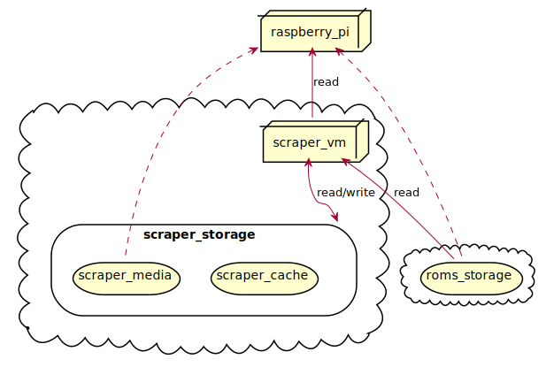
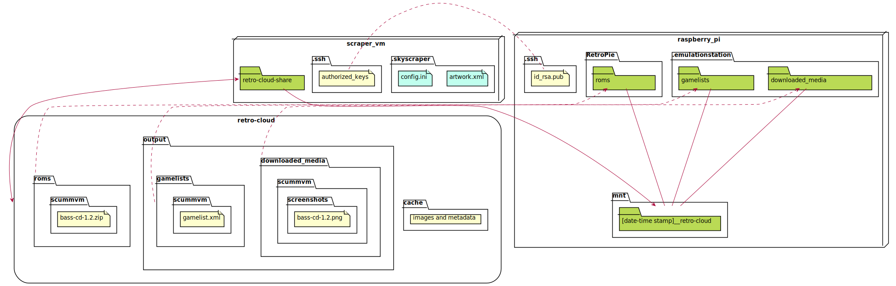

Running ROMs from the cloud
---

An expensive and over-engineered approach to storing ROMs and their metadata which sets out to answer the question:
> Why buy a cheap USB stick when you can use multiple expensive services in the Cloud?

## Setup

1. Install Retro-Cloud on the Raspberry Pi (creates the VM for step 2):

    ```bash
    $ curl -fsSL https://raw.githubusercontent.com/seriema/retro-cloud/master/raspberry-pi/download-and-run.sh | bash
    # Or:
    $ curl -fsSL https://tiny.cc/retro-cloud-setup | bash

    # Or the latest development version:
    $ curl -fsSL https://tiny.cc/rc-rpi | bash
    ```

    > **NOTE!** You will be prompted to log into your Azure account. The script pauses with the message:
    >
    > `WARNING: To sign in, use a web browser to open the page https://microsoft.com/devicelogin and enter the code ABCD12345 to authenticate.`

    * In case the setup fails before creating all necessary Azure resources it's easiest to tear them down and try again:
        1. `$ cd retro-cloud-setup`
        1. `$ bash teardown.sh`
        1. `$ rm -f "$HOME/.retro-cloud.env"`
        1. `$ bash setup.sh`

1. Install Retro-Cloud on the VM. Alternatives:
    * On the Raspberry Pi:

        ```bash
        $ bash -i setup-vm.sh
        ```

    * On the VM. Log into the VM from the RPi with `$ bash -i ssh-vm.sh`, or any other way you want, and then run:

        ```bash
        $ curl -fsSL https://raw.githubusercontent.com/seriema/retro-cloud/master/virtual-machine/setup.sh | bash
        # Or:
        $ curl -fsSL https://tiny.cc/retro-cloud-setup-vm | bash

        # Or the latest development version:
        $ curl -fsSL https://tiny.cc/rc-vm | bash
        ```

1. Copy ROMs to Azure File Share. Alternatives:
    * If you already had ROMs on the Raspberry Pi: They're now in `roms.bak` and can be copied over:

        ```bash
        $ cp -R RetroPie/roms.bak/. RetroPie/roms/
        ```

    * If you have ROMs on a desktop: Use [Azure Storage Explorer](https://azure.microsoft.com/en-us/features/storage-explorer/) and copy them to `Storage Accounts/[numbers]storage/Files Shares/retro-cloud/RetroPie/roms`
1. Add scraper credentials. Retro-Cloud uses [Skyscraper by Lars Muldjord](https://github.com/muldjord/skyscraper) for scraping. It supports adding credentials the scraper modules, which can allow you to scrape using more threads, priority when the source is under heavy load, or access to sources that require credentials. Read more [here](https://github.com/muldjord/skyscraper/blob/master/docs/CONFIGINI.md#usercredscredentials-or-key). Alternatives:
    * On the Raspberry Pi: `$ ./add-scraper-credential.sh MODULE USER PASSWORD`
    * On the VM: `$ ./add-scraper-credential.sh MODULE USER PASSWORD`
1. Scrape for metadata. Alternatives:
    > Note: This will take a _long_ time. A test run of 6 platforms with 13k files took 10 hours. EmulationStation must not be running during this time.
    * On the Raspberry Pi: `$ bash -i run-scraper.sh`
    * On the VM: `$ ./run-skyscraper.sh`

## Development

### Architecture



### File structure




### Prerequisites

* PowerShell 7+
* Bash 4.4.12+
* Docker Engine 19+ (Optional, but highly recommended)

### Workflow

This project is in large part install scripts running on someone's Raspberry Pi for the first time. To ensure installation works it's crucial to test on a new RetroPie installation each time. Wiping a SD-card after every test can be time consuming, so there is a Docker image to make this convenient. Therefore, there are three main areas of development: test environment, install scripts, and functionality.

1. **The test environment:** A best-effort Docker image to represent a newly installed RetroPie installation, as there is no official Docker image for neither Raspbian (the RaspberryPi OS) nor RetroPie. It can run slimmed down as a user's RetroPie, or with some install scripts pre-run and with the source code available inside the container.
1. **The install scripts:** Bash and PowerShell scripts that installs all the needed tools and applications to create and connect all Azure resources with the user's RetroPie.
    > Tip: Use `docker/start.sh` while working on the scripts for faster iteration, and `start.sh` to test run them from scratch.
1. **The functionality:** Part of the install scripts, but focusing on the features available after installation. Such as ROM scraping.

* Development
    * `docker/setup.sh` sets up environment variables for automation (same as used in CI) in a `.env` file in the root. Avoid the Azure login prompt by setting up a Service Principle account.
        > Tip: Use `docker/dev/create-service-principal.ps1` to conveniently create a Service Principle, and store the results in the `.env` file.
    * `docker/build.sh` to build a Docker image meant for running locally. The tag is `rc:[branch name]`.
    * `docker/test.sh` to validate the built Docker image.
    * `docker/start.sh` to run a throwaway Docker container that:
        * Makes the source code available inside the container as `~/retro-cloud-source`, and uses it as the work directory.
        * Caches some install steps as named volumes (i.e. PowerShell).
        * Adds environment variables from the `.env` file for automation (see `docker/setup.sh`).
    * `docker/publish-arm.sh` to build and push an ARM image of the master branch to Docker Hub as `seriema/retro-cloud:latest-arm32v7`. The AMD image is built by Docker Hub automated builds as `seriema/retro-cloud:latest-amd64`.
    * `lint.sh` to lint all `.sh` files through a Docker image with [shellcheck](https://github.com/koalaman/shellcheck), and check their execution permissions.
    * `.env` file: Used to store environment variables useful during development. It consists of:
        1. Azure automation
            * `AZURE_TENANT_ID`
            * `AZURE_SERVICE_PRINCIPAL_USER`
            * `AZURE_SERVICE_PRINCIPAL_SECRET`
        1. Retro-Cloud setup (re-use an Azure infrastructure between runs by copying these values from the RPi's `$HOME/.retro-cloud.env`)
            * `RETROCLOUD_VM_IP`
            * `RETROCLOUD_VM_USER`
            * `RETROCLOUD_VM_SHARE`
            * `RETROCLOUD_AZ_RESOURCE_GROUP`
        1. CircleCI scripting
            * `CIRCLECI_API_USER_TOKEN`
* Testing install scripts as a user
    * `start.sh` to run a throwaway Docker container using the latest release image.
    * To test a specific branch:
        * `branch=[the branch you want to test]`, e.g. `branch=upgrade-powershell`
        * `curl -fOL "https://raw.githubusercontent.com/seriema/retro-cloud/${branch}/raspberry-pi/download-and-run.sh"`
        * `bash download-and-run.sh "$branch"`
        * `rm download-and-run.sh`
    * To validate that the image is correct:
        * `docker/compose/run_tests.sh`
* Continous Integration with CircleCI
    * `.circleci/build-all-commits.sh` to queue a build for every commit between current branch and develop. Meant to be used before creating a PR or merging to develop so that each commit is validated.

### Notes on Windows

Some of the Bash scripts above don't work on Windows (Git Bash) so there are some PowerShell equivalents. They aren't guaranteed to be as powerfull as the Bash scripts.

* Development
    * `docker/start.ps1`
    * `docker/test.ps1`
    > **Note:** Requires File Sharing to be enabled. See the [Docker documentation](https://docs.docker.com/docker-for-windows/#file-sharing).
