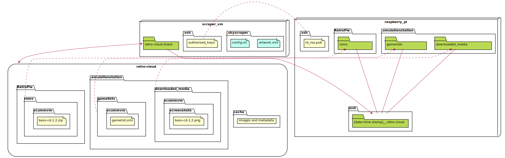

Running ROMs from the cloud
---

An expensive and over-egineered approach to storing ROMs and their metadata which sets out to answer the question:
> Why buy a cheap USB stick when you can use multiple expensive services in the Cloud?

## Architecture


### File structure



## Setup

1. Install Retro-Cloud on the Raspberry Pi (creates the VM for step 2):
    ```
    wget -O - https://raw.githubusercontent.com/seriema/retro-cloud/develop/raspberry-pi/setup.sh | bash
    ```
    > Connect to the VM with: `$ bash -i ssh-vm.sh`
1. Install Retro-Cloud on the VM:
    ```
    wget -O - https://raw.githubusercontent.com/seriema/retro-cloud/develop/virtual-machine/setup.sh | bash
    ```
1. Copy ROMs to Azure File Share. Alternatives:
    * If you already had ROMs on the Raspberry Pi: They're now in `roms.bak` and can be copied over:
        ```
        $ cp -R RetroPie/roms.bak/. RetroPie/roms/
        ```
    * If you have ROMs on a desktop: Use [Azure Storage Explorer](https://azure.microsoft.com/en-us/features/storage-explorer/) and copy them to `Storage Accounts/[numbers]storage/Files Shares/retro-cloud/RetroPie/roms`
1. Scrape for metadata. Alternatives:
    > Note: This will take a _long_ time. A test run of 6 platforms with 13k files took 10 hours. EmulationStation must not be running during this time.
    * On the Raspberry Pi: `$ bash -i run-scraper.sh`
    * On the VM: `$ ./run-skyscraper.sh`
