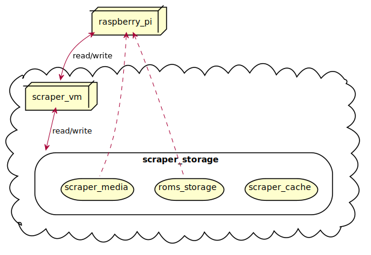

Running ROMs from the cloud
---

An expensive and over-engineered approach to storing ROMs and their metadata which sets out to answer the question:
> Why buy a cheap USB stick when you can use multiple expensive services in the Cloud?

## Architecture



### File structure


## Setup

1. Install Retro-Cloud on the Raspberry Pi (creates the VM for step 2):

    ```bash
    $ curl -sSL https://raw.githubusercontent.com/seriema/retro-cloud/develop/raspberry-pi/download-and-run.sh | bash
    ```

    > **NOTE!** You will be prompted to log into your Azure account. The script pauses with the message:
    >
    > `WARNING: To sign in, use a web browser to open the page https://microsoft.com/devicelogin and enter the code ABCD12345 to authenticate.`

1. Install Retro-Cloud on the VM. Alternatives:
    * On the Raspberry Pi:

        ```bash
        $ bash -i setup-vm.sh
        ```

    * On the VM. Log into the VM from the RPi with `$ bash -i ssh-vm.sh`, or any other way you want, and then run:

        ```bash
        $ curl -sSL https://raw.githubusercontent.com/seriema/retro-cloud/develop/virtual-machine/setup.sh | bash -i
        ```

1. Copy ROMs to Azure File Share. Alternatives:
    * If you already had ROMs on the Raspberry Pi: They're now in `roms.bak` and can be copied over:

        ```bash
        $ cp -R RetroPie/roms.bak/. RetroPie/roms/
        ```

    * If you have ROMs on a desktop: Use [Azure Storage Explorer](https://azure.microsoft.com/en-us/features/storage-explorer/) and copy them to `Storage Accounts/[numbers]storage/Files Shares/retro-cloud/RetroPie/roms`
1. Scrape for metadata. Alternatives:
    > Note: This will take a _long_ time. A test run of 6 platforms with 13k files took 10 hours. EmulationStation must not be running during this time.
    * On the Raspberry Pi: `$ bash -i run-scraper.sh`
    * On the VM: `$ ./run-skyscraper.sh`

## Development

### Windows/Linux/macOS

* Development
    * `docker run --privileged -it --rm -v home:/home/pi -v az:/.Azure -v opt:/opt -v mnt:/mnt seriema/retro-cloud:amd64`
    * `git clone git@github.com:seriema/retro-cloud.git && cd retro-cloud && git checkout develop`
* Testing
    * `docker run --privileged -it --rm seriema/retro-cloud:develop`
* Docker
    * `docker build -t seriema/retro-cloud:amd64 .`
    * `docker push seriema/retro-cloud:amd64`

### Raspberry Pi

* Development
    * `docker run --privileged -it --rm -v home:/home/pi seriema/retro-cloud:arm32v7`
* Testing
    * `docker run --privileged -it --rm lasery/retropie:19.09-arm32v6 /bin/bash`
* Docker
    * `docker build -t seriema/retro-cloud:arm32v7 .`
    * `docker push seriema/retro-cloud:arm32v7`
